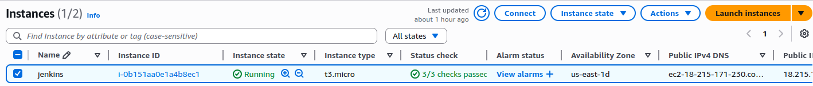
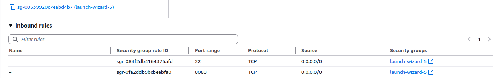
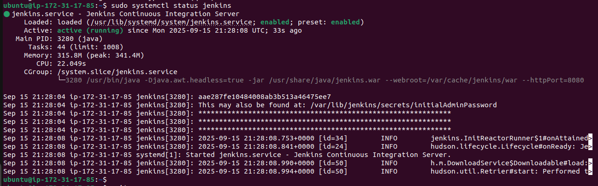
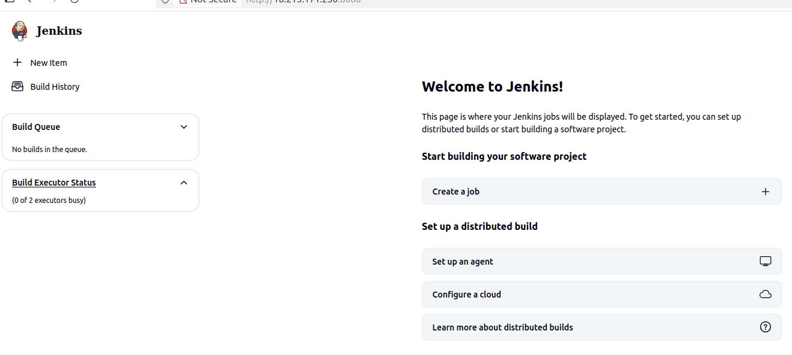

# Jenkins Installation on Amazon EC2 (Ubuntu)

This guide provides step-by-step instructions for installing Jenkins on an Ubuntu Amazon EC2 instance.

## Prerequisites

    ✅ An AWS account

    ✅ Basic knowledge of AWS EC2 and SSH

    ✅ A security group with appropriate ports (22 & 8080) open

Step 1 (a): Launch an Ubuntu EC2 Instance

    - Log in to your AWS Management Console

    - Navigate to EC2 service

    - Click "Launch Instance"

    - Choose an Ubuntu Server AMI (22.04 LTS or 20.04 LTS recommended)

    - Select an instance type (t2.micro is sufficient for testing)

    - Configure instance details 

    

Configure Security Group (b):

        Add rules to allow traffic on the following ports:

            SSH (port 22) - from your IP only for security

            Custom TCP (port 8080) - from anywhere (0.0.0.0/0) - Jenkins default port

    Review and launch the instance

    Select or create a key pair and download it

Step 2: Connect to Your EC2 Instance
bash

### Change permissions on your key file
chmod 400 your-key-pair.pem

### Connect to your Ubuntu instance
ssh -i "your-key-pair.pem" ubuntu@your-ec2-public-ip

Step 3: Update System and Install Java
bash

### Update package list
sudo apt update

### Upgrade existing packages
sudo apt upgrade -y

### Install Java (Jenkins requires Java 11 or 17)
sudo apt install openjdk-11-jdk -y

### Verify Java installation
java -version

Step 4: Install Jenkins
bash

### Add Jenkins repository key to the system
curl -fsSL https://pkg.jenkins.io/debian/jenkins.io-2023.key | sudo tee \
  /usr/share/keyrings/jenkins-keyring.asc > /dev/null

### Add Jenkins repository to apt sources
echo deb [signed-by=/usr/share/keyrings/jenkins-keyring.asc] \
  https://pkg.jenkins.io/debian binary/ | sudo tee \
  /etc/apt/sources.list.d/jenkins.list > /dev/null

### Update package list to include Jenkins repository
sudo apt update

### Install Jenkins
sudo apt install jenkins -y

### Start Jenkins service
sudo systemctl start jenkins

### Enable Jenkins to start on boot
sudo systemctl enable jenkins

### Check Jenkins status
sudo systemctl status jenkins

Step 5: Access Jenkins Web Interface

    Get the initial admin password:

bash

sudo cat /var/lib/jenkins/secrets/initialAdminPassword

#######################

    Open your web browser and navigate to:

http://your-ec2-public-ip:8080

    Enter the admin password when prompted

    Follow the setup wizard to:

        Install suggested plugins

        Create an admin user

        Configure your Jenkins instance

## Resources

    📚 Jenkins Official Documentation

    📚 AWS EC2 Documentation

    📚 Ubuntu Server Guide

## Support

If you encounter issues:

    Check Jenkins logs: /var/log/jenkins/jenkins.log

    Verify Java installation: java -version

    Confirm Jenkins is running: sudo systemctl status jenkins

    Ensure security group allows traffic on port 8080 (or 80 if configured)